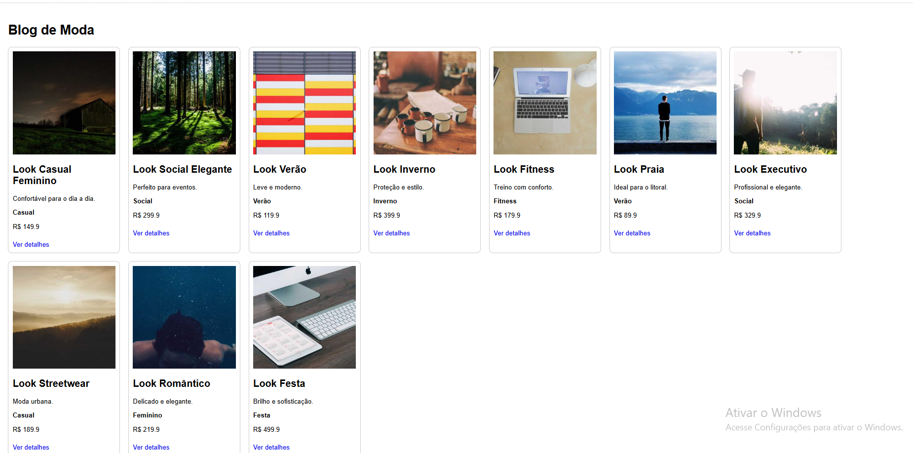
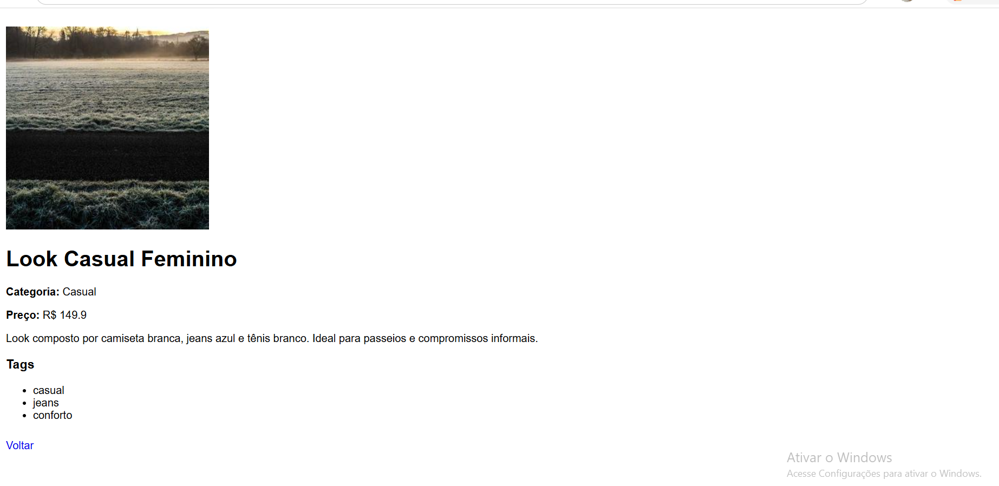

[](https://classroom.github.com/a/3AYGT_Y7)
# Trabalho Prático - Semana 13

Nessa etapa, você irá evoluir o projeto do semestre, montando o ambiente de desenvolvimento mais completo, típico de projetos profissionais. Nesse processo, vamos utilizar um **servidor backend simulado** com o JSON Server que fornece uma APIs RESTful a partir de um arquivo JSON.

Para esse projeto, além de mudarmos o JSON para o JSON Server, vamos permitir o cadastro e alteração de dados da entidade principal (CRUD).

## Informações do trabalho

- Nome:Anna Luiza Pereira Silva
- Matricula:1656540
- Proposta de projeto escolhida:Blog de moda
- Breve descrição sobre seu projeto:O projeto foi pensado para ajudar as pessoas a escolher suas peças/looks e deixar-las informadas sobre lançamentos de moda.

**Registros do trabalho**

<< DADOS DO DB.JSON (ENTIDADE PRINCIPAL E SECUNDÁRIA) >>

```json
{
  "looks": [
    {
      "id": 1,
      "nome": "Look Casual Feminino",
      "descricaoCurta": "Confortável para o dia a dia.",
      "descricaoCompleta": "Look composto por camiseta branca, jeans azul e tênis branco. Ideal para passeios e compromissos informais.",
      "imagem": "https://picsum.photos/300?1",
      "categoria": "Casual",
      "preco": 149.90,
      "tags": ["casual", "jeans", "conforto"],
      "destaque": true
    },
    {
      "id": 2,
      "nome": "Look Social Elegante",
      "descricaoCurta": "Perfeito para eventos.",
      "descricaoCompleta": "Blazer preto, camisa social branca e calça de alfaiataria.",
      "imagem": "https://picsum.photos/300?2",
      "categoria": "Social",
      "preco": 299.90,
      "tags": ["social", "elegante"],
      "destaque": true
    },
    {
      "id": 3,
      "nome": "Look Verão",
      "descricaoCurta": "Leve e moderno.",
      "descricaoCompleta": "Vestido floral leve ideal para dias quentes.",
      "imagem": "https://picsum.photos/300?3",
      "categoria": "Verão",
      "preco": 119.90,
      "tags": ["verão", "floral"],
      "destaque": false
    },
    {
      "id": 4,
      "nome": "Look Inverno",
      "descricaoCurta": "Proteção e estilo.",
      "descricaoCompleta": "Casaco de lã, cachecol e botas.",
      "imagem": "https://picsum.photos/300?4",
      "categoria": "Inverno",
      "preco": 399.90,
      "tags": ["inverno", "casaco"],
      "destaque": false
    },
    {
      "id": 5,
      "nome": "Look Fitness",
      "descricaoCurta": "Treino com conforto.",
      "descricaoCompleta": "Conjunto esportivo respirável para academia.",
      "imagem": "https://picsum.photos/300?5",
      "categoria": "Fitness",
      "preco": 179.90,
      "tags": ["fitness", "academia"],
      "destaque": true
    },
    {
      "id": 6,
      "nome": "Look Praia",
      "descricaoCurta": "Ideal para o litoral.",
      "descricaoCompleta": "Saída de praia e acessórios leves.",
      "imagem": "https://picsum.photos/300?6",
      "categoria": "Verão",
      "preco": 89.90,
      "tags": ["praia", "verão"],
      "destaque": false
    },
    {
      "id": 7,
      "nome": "Look Executivo",
      "descricaoCurta": "Profissional e elegante.",
      "descricaoCompleta": "Conjunto formal para ambiente corporativo.",
      "imagem": "https://picsum.photos/300?7",
      "categoria": "Social",
      "preco": 329.90,
      "tags": ["executivo", "formal"],
      "destaque": true
    },
    {
      "id": 8,
      "nome": "Look Streetwear",
      "descricaoCurta": "Moda urbana.",
      "descricaoCompleta": "Moletom oversized e tênis esportivo.",
      "imagem": "https://picsum.photos/300?8",
      "categoria": "Casual",
      "preco": 189.90,
      "tags": ["streetwear", "urbano"],
      "destaque": false
    },
    {
      "id": 9,
      "nome": "Look Romântico",
      "descricaoCurta": "Delicado e elegante.",
      "descricaoCompleta": "Vestido midi em tons pastel.",
      "imagem": "https://picsum.photos/300?9",
      "categoria": "Feminino",
      "preco": 219.90,
      "tags": ["romântico", "vestido"],
      "destaque": false
    },
    {
      "id": 10,
      "nome": "Look Festa",
      "descricaoCurta": "Brilho e sofisticação.",
      "descricaoCompleta": "Vestido longo com detalhes brilhantes.",
      "imagem": "https://picsum.photos/300?10",
      "categoria": "Festa",
      "preco": 499.90,
      "tags": ["festa", "elegante"],
      "destaque": true
    }
  ],

  "categorias": [
    { "id": 1, "nome": "Casual" },
    { "id": 2, "nome": "Social" },
    { "id": 3, "nome": "Verão" },
    { "id": 4, "nome": "Inverno" }
  ],

  "comentarios": [
    {
      "id": 1,
      "lookId": 1,
      "autor": "Maria",
      "texto": "Muito bonito!"
    }
  ]
}
```






## **Orientações Gerais**

Nesse projeto você vai encontrar a seguinte estrutura base:

* **Pasta db**
  Essa pasta contem um único arquivo: `db.json`. Esse arquivo serve de banco de dados simulado e nele você deve colocar as estruturas de dados que o seu projeto manipula.
  * **OBS**: Já incluímos a estrutura de usuários como exemplo e para que você possa utlizar no seu projeto. Se precisar, faça os ajustes necessários para seu projeto.
* **Pasta public**
  Nesta pasta você deve colocar todos os arquivos do seu site (front end). Aqui vão os arquivos HTML, CSS, JavaScript, imagens, vídeos e tudo o mais que precisar para a interface do usuário.
* **Arquivo README.md**
  Este arquivo em que são colocadas as informações de quem está desenvolvendo esse projeto e os registros solicitados no enunciado da tarefa.
* **Arquivo .gitignore**
  Configuração do que deve ser ignorado pelo git evitando que seja enviado para o servidor no GitHub.
* **Arquivo package.json**
  Considerado o manifesto do projeto ou arquivo de configuração. Nesle são incluídas as informações básicas sobre o projeto (descrição, versão, palavras-chave, licença, copyright), a lista de pacotes dos quais o projeto depende tanto para desenvolvimento quanto execução, uma lista de  do projeto, scripts entre outras opções.
  * **OBS**: Esse arquivo é criado assim que o projeto é iniciado por meio do comando `npm init`.
  * **OBS2**: Esse arquivo já traz a informação de necessidade do JSONServer.
* **Pasta node_modules**
  Local onde ficam os pacotes dos quais o projeto depende. Evite enviar essa pasta para o repositório remoto. Essa pasta é reconstruída toda vez que se executa o comando `npm install`.

**Ambiente de Desenvolvimento (IMPORTANTE)**

> A partir de agora, **NÃO utilizamos mais o LiveServer/FiveServer** durante o processo de desenvolvimento. O próprio JSONServer faz o papel de servidor.

Para iniciar o JSONServer e acessar os arquivos do seu site, siga os seguintes passos:

1. Abra a pasta do projeto dentro da sua IDE (por exemplo, Visual Studio Code)
2. Abra uma janela de teminal e certifique-se que a pasta do terminal é a pasta do projeto
3. Execute o comando `npm install`
   Isso vai reconstruir a pasta node_modules e instalar todos os pacotes necessários para o nosso ambiente de desenvolvimento (Ex: JSONServer).
4. Execute o comando `npm start`
   Isso vai executar o JSONServer e permitir que você consiga acessar o seu site no navegador.
5. Para testar o projeto:
   1. **Site Front End**: abra um navegador e acesse o seu site pela seguinte URL: 
      [http://localhost:3000]()
   2. **Site Back End**: abra o navegador e acesse as informações da estrutura de usuários por meio da API REST do JSONServer a partir da seguinte URL: 
      [http://localhost:3000/usuarios](http://localhost:3000/usuarios)

Ao criar suas estruturas de dados no arquivo db.json, você poderá obter estes dados através do endereço: http://localhost:3000/SUA_ESTRUTURA, tal qual como foi feito com a estrutura de usuários. **IMPORTANTE**: Ao editar o arquivo db.json, é necessário parar e reiniciar o JSONServer.

**IMPORTANTE:** Assim como informado anteriormente, capriche na etapa pois você vai precisar dessa parte para as próximas semanas. 

**IMPORTANTE:** Você deve trabalhar:

* na pasta **`public`,** para os arquivos de front end, mantendo os arquivos **`index.html`**, **`detalhes.html`**, **`styles.css`** e **`app.js`** com estes nomes, e
* na pasta **`db`**, com o arquivo `db.json`.

Deixe todos os demais arquivos e pastas desse repositório inalterados. **PRESTE MUITA ATENÇÃO NISSO.**
